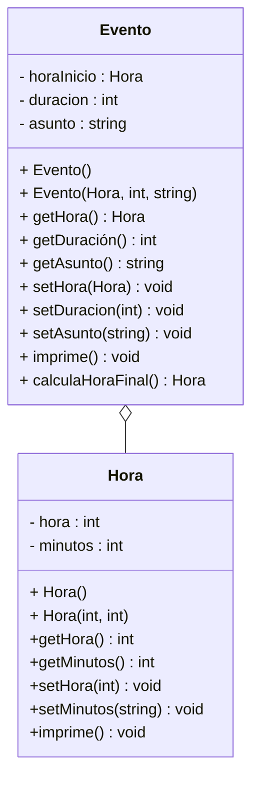

# Ejercicio-Autograding para C++ usando Catch2

**Fuente:** *Learning Autograding with C/C++ and Catch2 - Prof. Igor Machado Coelho* 
https://medium.com/swlh/easy-c-autograding-on-github-classroom-with-catch2-106ad1107402

## Descripción del Problema

Una empresa de eventos requiere un sistema para manejar la agenda de eventos contratados. De un evento nos interesa conocer la hora de inicio (hora y minutos), el asunto del evento y la duración en minutos.
La hora es mucho mejor si la manejamos como una clase para manejar más facilmente los cambios y poder hacer cálculos.

Observa el diagrama de clase creado para resolver este escenario:

## Detalles de implementación
**Sobre la clase Hora**
* La clase Hora representa hora del día en formato de 24 horas
* El constructor default de hora inicializa para representar las 8 de la mañana
* En los setters de Hora se debe validar que la hora no sea mayor a 23 y los minutos a 59
* En el setter de hora si te dan un número no válido para cambiar la hora, que se ponga en su lugar un 0
* En el setter de minutos si te dan un número no válido para cambiar los minutos, que en su lugar quede un 0
* Usa los setters en el constructor con parámetros para que también se valide al construir el objeto

**Sobre la clase Evento**
* En el constructor defalult de Evento el asunto es "Sin Asunto", la duración 60 minutos y la Hora la default
* En el imprime de Evento has uso del imprime de hora.
* En el método de calculaHoraFinal, debes hacer algun procedimiento para sumar los minutos a la hora inicial y construir un objeto Hora con la hora calculada, esa objeto Hora creado es el que devuelve ese método. 

## Objetivo

- Busca que el código pase correctamente todas las pruebas
   * Solamente cambia los archivos permitidos para lograr este objetivo (abajo se indican las reglas específicas)
   
- Las GitHub Actions deberán presentar una palomita en verde si se han satisfecho todas las pruebas, y una cruz roja cuando alguna (o todas) las pruebas han fallado.
   * **Recomendación:** Puedes dar clic en la cruz roja para verificar cual de las pruebas ha fallado (o si el código no ha compilado correctamente).
   * **Recomendación:** En caso de que el Autograding no muestre pruebas o no funcione, contacta a tu profesor mediante un issue.

## Instrucciones

- Deberás modificar SOLAMENTE los archivos `Hora.cpp` `Evento.cpp` `exercise.cpp`
 
Explicación de los otros archivos:

- Archivo `test/tests.cpp` tiene las pruebas de esta actividad (NO LO CAMBIES!)
- Archivo `test/catch.hpp` tiene la biblioteca de pruebas  CATCH2 (NO LA CAMBIES!)
- Archivo `makefile` tienes los comandos para ejecutar la actividad (NO LO CAMBIES!)
- Archivo  `./build/appTests` se generará después de compilar (para **pruebas locales**, solo ejecútalo)

## Comandos para pruebas locales, ejecución y depuración

- Comando para construir y ejecutar pruebas: `make` o `make test`
    * Si el ejecutable ya está construido, sólo teclea : `./build/appTests`

- Comando para construir y ejecutar la aplicación: `make run` 
    * Si el ejecutable ya está construido, sólo teclea : `./build/exercise`

- Comando para depurar: `make debug`
    * Para conocer los comandos de depuración consulta:
     https://u.osu.edu/cstutorials/2018/09/28/how-to-debug-c-program-using-gdb-in-6-simple-steps/
     
- Comando para depurar con `vsCode` en `GitPod`: `make debugvs` 
    * Utilizar el depurador de la IDE.     

## Notas

- El código será evaluado solamente si compila.
   * La razón de esto es, si no compila no es posible generar el ejecutable y realizar las pruebas.

- Algunos casos de prueba podrían recibir calificación individual, otros podrían recibir calificación y si pasan todos juntos (o todas las pruebas en conjunto).

- La calificación final se otorgará de manera automática en cada *commit*, y se evaluará solamente hasta la fecha limite de la actividad.

Para dudas adicionales, consulta a tu profesor.

## License

MIT License 2020
